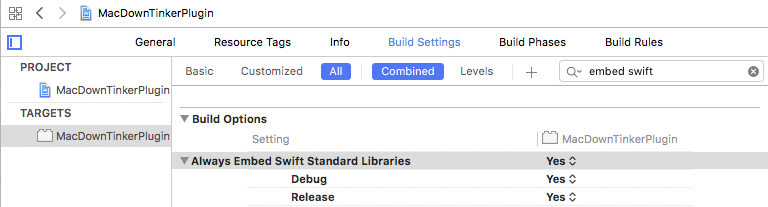
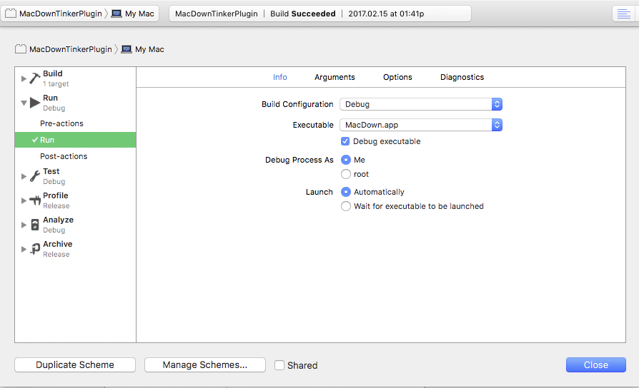

MacDownTinkerPlugin README
==========================

Current MacDown Plugin Limitations
----------------------------------

This Swift plugin with MacDown 0.6.4 has the found the following MacDown behavior at the time of this writing:

1. Swift needs to access the MacDown `markdown` text with `document.value(forKey: "markdown") as? String`.  (See `document.attributeKeys` for the other keys.)
2. Changing the `markdown` content via the plugin does write to the document markdown editor. 
3. Changing the `markdown` content via the plugin does not have an undo.
4. Changing the `markdown` content via the plugin does not have the document transition to a needs-to-be-saved state.
6. `isDocumentEdited` is currently read only, so the plugin cannot directly mark the document as changed.
6. The html does not re-render without either making a subsequent manual markdown edit, or selecting the menu item View > Render HTML.
7. Writing to the `fileURL` does not automatically update into the markdown editor.


How To Create a Swift Plugin for MacDown
----------------------------------------

Step 1. Create **OS X → Framework & Library → Bundle** project  

Step 2. Add `MacDownTinkerPlugin.swift` 

``` swift
import Cocoa

public class MacDownTinkerPlugin: NSObject {
    
    // MacDown Required property
    public let name: String = "Tinker! v0.1"
    
    // MacDown Required function selector
    public func run(_ sender: NSMenuItem) -> Bool {
        print("sender:\n\(sender)")
        let dc: NSDocumentController = NSDocumentController.shared()
        
        if let doc = dc.currentDocument {
            let result = doTinker(document: doc)
            return result
        }        
        return false
    }
    
    func doTinker(document: NSDocument) -> Bool {
        print("doTinker")
        return true
    }
    
}
```

Step 3. Edit `info.plist`.  Add `CFBundleSignature`. Fill in `NSPrincipalClass` string.

``` xml
	<key>CFBundleSignature</key>
	<string>????</string>
	<key>CFBundleVersion</key>
	<string>1</string>
	<key>NSPrincipalClass</key>
	<string>MacDownTinkerPlugin</string>
```

Step 4. Embed Swift Standard Libraries.



Step 5. Setup Debug

a. Add (+) `New Copy Files Phase` to target Build Phases   
b. Select Destination `Absolute Path` and enter Path `~/Library/Application Support/MacDown/PlugIns`  
c. Add (+) the generated file.plugin to the files list. 


